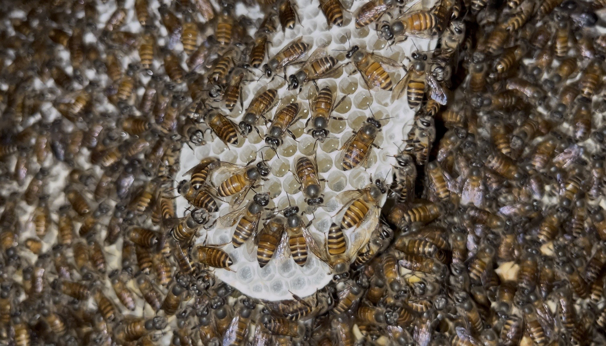
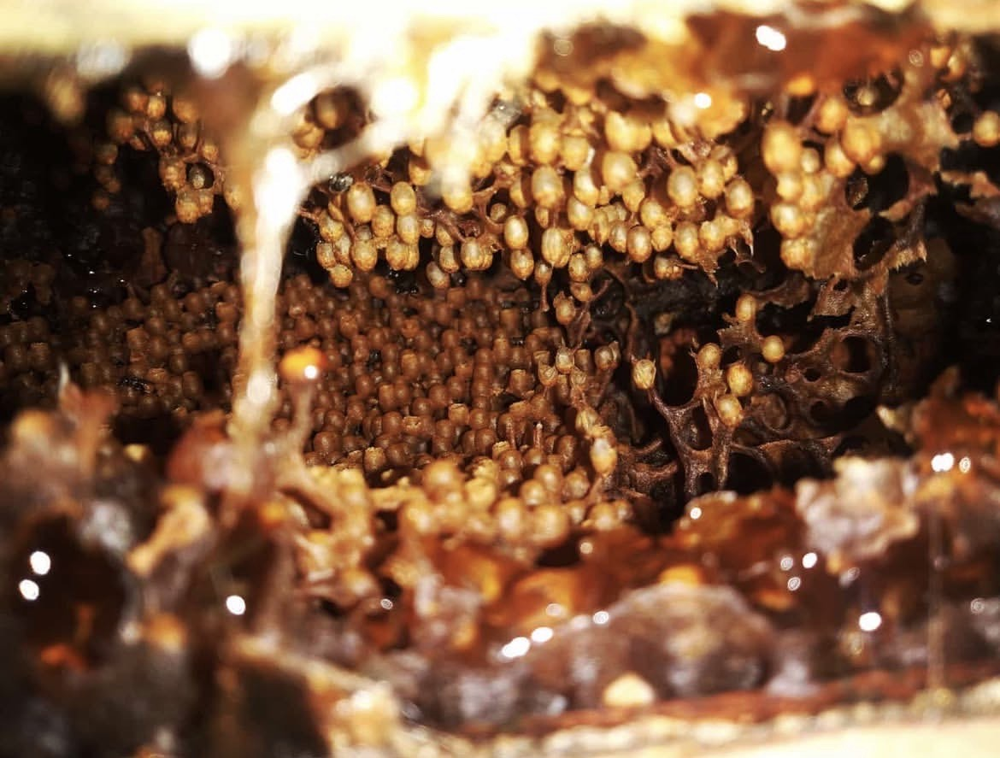
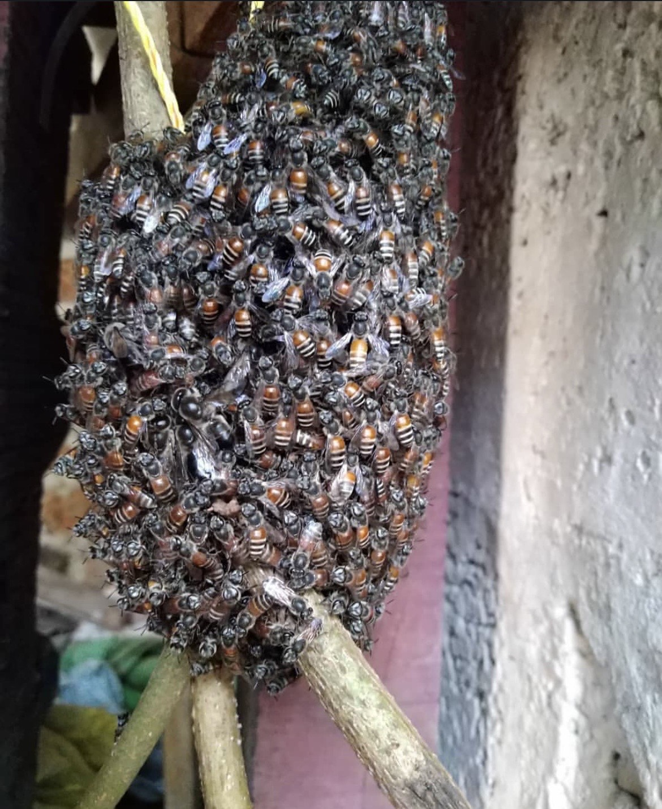

# 🐝 Field Observations 
This folder documents **direct observations of bee behavior** that inform design decisions in the modular beehive system. These observations focus on **movement, clustering, comb usage, and colony interaction with structure**, rather than hardware design.

## Observed Species & Contexts

### Apis cerana

Observed in cavity-based and managed environments, showing
compact clustering and vertically aligned comb usage.

---

### Apis florea (Dwarf Bee)

Observed forming open, minimal comb structures with high sensitivity
to disturbance and lightweight attachment.

---

### Wild Bee (Local Observation)

Observed in natural, unmanaged comb settings with adaptive spacing
and environment-driven structure.
