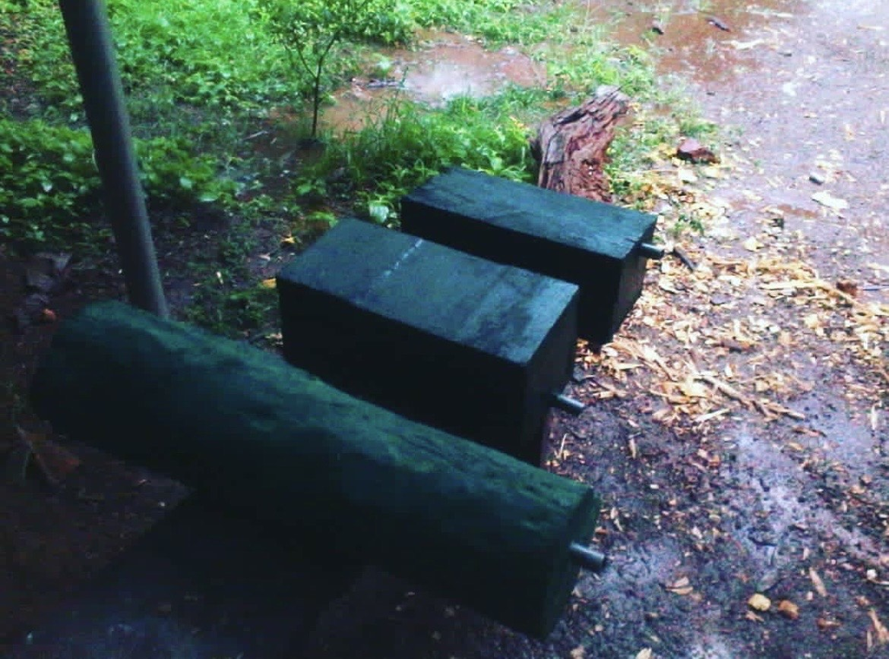
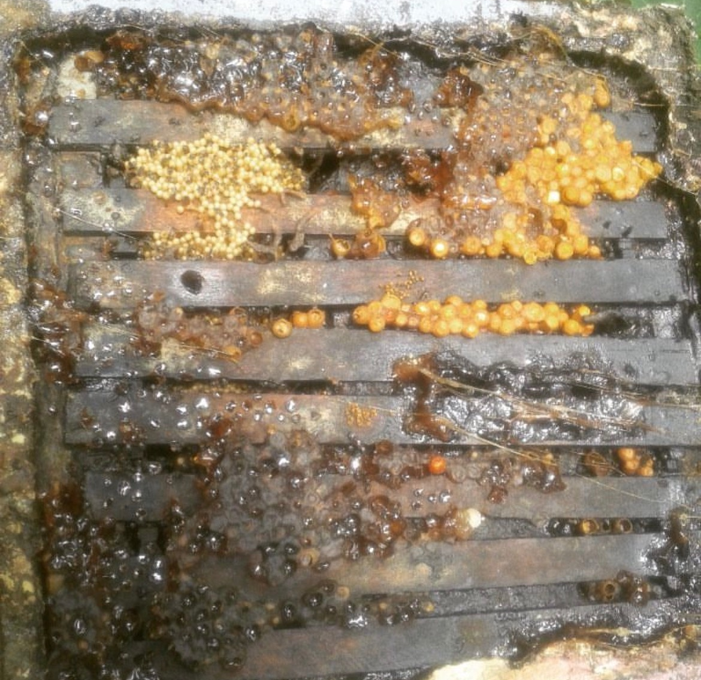
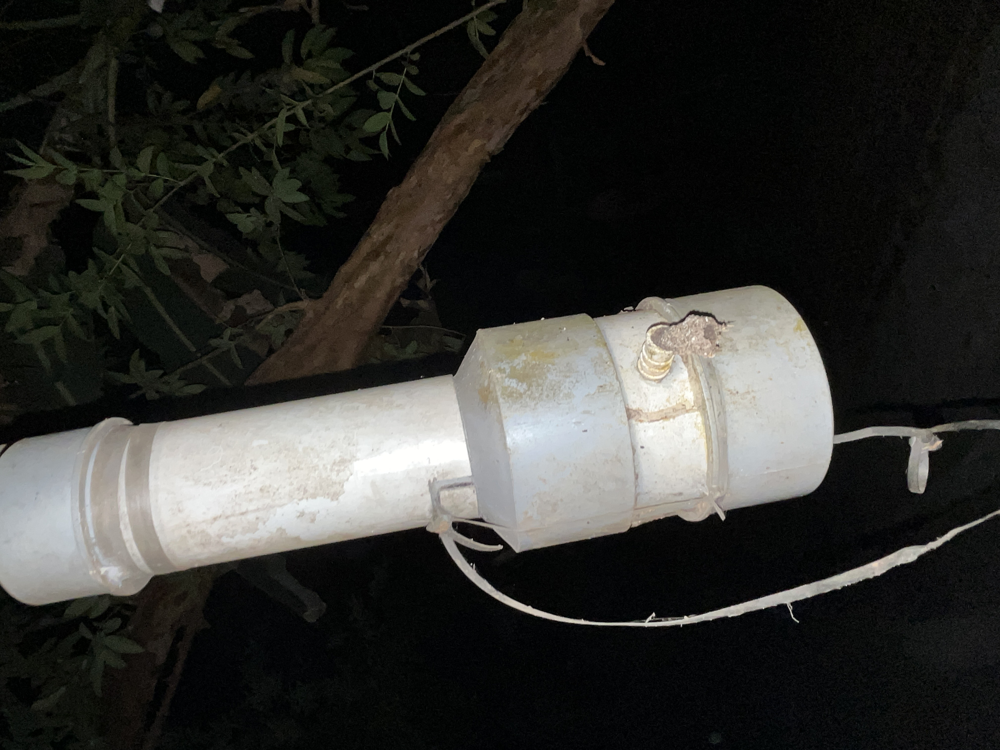

# 🐝 Previous Hive Builds & Practical Experience

This folder documents **earlier beehive builds and hands-on experience**
that informed the design direction of the current modular beehive system.

These builds are **not active designs** and are included for
historical context and design lineage.

---

## Traditional Hive (2018 Build)

- Fixed-volume structure  
- Required full disassembly for inspection  
- High colony disturbance during maintenance  

---

## Modified Hive (2017 Build)

- Partial access improvements  
- Reduced disturbance compared to traditional design  
- Limited scalability and repairability  

---

## Experimental Hive (2018 Build)

- Early modular concepts explored  
- Revealed alignment and tolerance challenges  
- Highlighted need for standardized stackable modules  

---

## Design Lineage Summary

Key lessons from these builds:
- Fixed bodies limit adaptive colony growth  
- Inspection methods directly impact colony stress  
- Repairability must be modular, not monolithic  

These observations directly influenced the
**stackable, replaceable, and bee-first architecture**
of the current modular beehive system.
