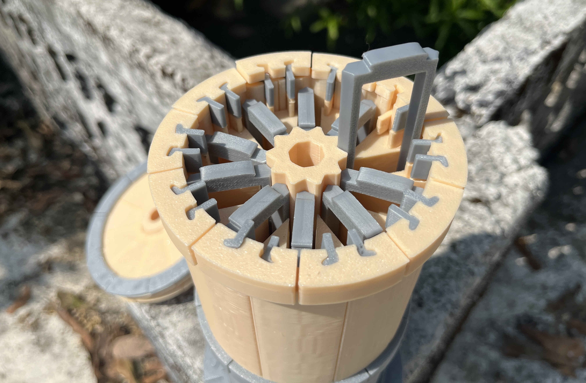

# 🧪 33% Scale Physical Prototype Validation

This folder documents the **33% scale FDM-printed prototype** of the Modular Beehive system.

The prototype was produced to validate:
- dimensional fitment
- stacking and alignment logic
- tolerance behavior
- support-free geometry
- internal airflow and access paths

---

## 📸 Prototype Images

### Assembled Prototype

### Internal View

### During Printing

---

## 🧠 Validation Notes

- All parts printed **without supports**
- Modules stack cleanly with consistent alignment
- Lock-ring geometry maintains spacing and rigidity
- Internal geometry remains accessible at reduced scale
- Design scales predictably toward full size

---

## 📌 Status

This prototype confirms the design is:
- mechanically viable  
- printable on consumer-grade machines  
- ready for full-scale iteration and field testing
